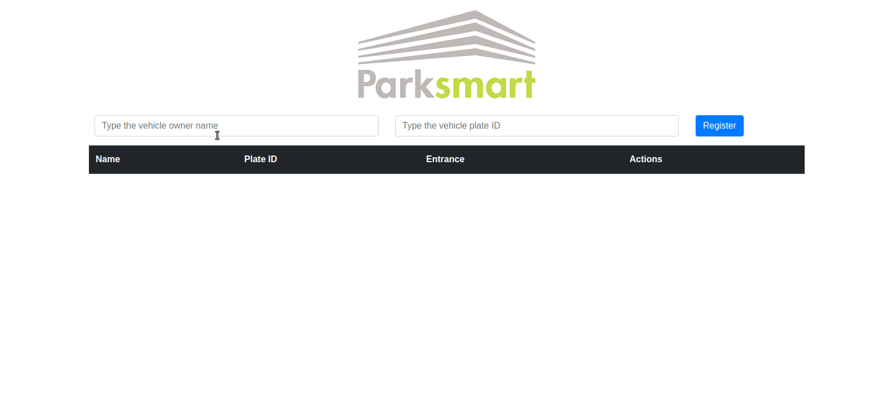

# Sobre o projeto_
# Sistema de estacionamento usando TypeScript 

Desafio do Bootcamp Spread Fullstack Developer da DIO: 

Criando um sistema de estacionamento usando TypeScript
---
# Skills / _Habilidades_

- HTML, CSS, Javascript
- Typescript
- Bootstrap
- Local Storage

---
# Layout

---

# Implantação_

**Veja em ação**: [https://kelsonbatista.github.io/dio-typescript-parking-lot/](https://kelsonbatista.github.io/dio-typescript-parking-lot/)
